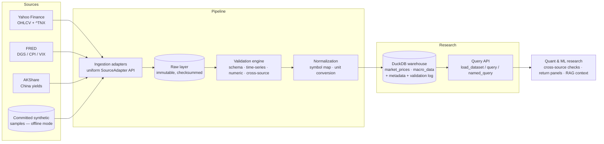

# financial-data-pipeline

A research-grade data infrastructure for quantitative and systematic finance. It takes raw
financial data from public sources and turns it into **reliable, reproducible, auditable**
research-ready datasets through a single, explicit path:

> ingestion → raw (immutable) → validation → normalization → research warehouse (DuckDB)

The point of the project is not the data itself — it is the **discipline around the data**:
knowing where every number came from, proving it was not silently changed, catching the
defects that real feeds actually ship, and being able to re-derive any result from a run id.

> This is a portfolio / learning project. It is built to be *correct and honest about its
> limits*, not to be a "production" or "institutional" data platform. See
> [Scope and honesty](#scope-and-honesty).

---

## Where this sits among my other repos

I have three other repositories that **acquire** data; this one is the **governance layer
that sits downstream of them** and is deliberately scoped so the two never overlap:

| Repo | Job | Relationship to this project |
|------|-----|------------------------------|
| `china-bond-announcement-scraper` | scrapes China Bond announcements | a *source*; its output could be fed in as a raw snapshot |
| `website-data-puller` | generic web table/HTML extraction | a *source*; extracts pages this project would not |
| `screen-data-ocr-tracker` | OCR of broker screenshots | a *source*; turns images into numbers this project would validate |

`financial-data-pipeline` does **not** scrape, crawl, or OCR anything. It assumes bytes
have already been obtained (here, from Yahoo Finance, FRED and AKShare, or from committed
synthetic samples) and owns everything that happens *after* acquisition: validation,
normalization, storage, versioning and the research query API. That separation is the whole
design premise — each repo stays small and does one job well.

---

## Architecture



### The layers

1. **Ingestion adapters.** Every source implements the same `SourceAdapter` contract
   (`availability`, `fetch`, `raw_schema`). Adapters only obtain bytes and describe them
   honestly — they do **not** rename, retype or clean. A single `OfflineReplayAdapter`
   serves committed samples so the whole pipeline runs with no network and no API key.
2. **Raw layer.** Append-only, text-faithful snapshots with a manifest
   (SHA-256, row count, observed dtypes, fetch params). Everything downstream can be
   recomputed from here alone.
3. **Validation engine.** A severity model (`INFO` / `WARNING` / `ERROR`). `ERROR` means
   the dataset is **quarantined** (never loaded); `WARNING` means it loads but the issue is
   stored next to the data. Checks span schema drift, time-series integrity, financial
   logic (OHLC ordering, positive prices, extreme returns, missingness) and, uniquely,
   **cross-source consistency**.
4. **Normalization.** Source symbols and series are mapped to canonical identifiers; units
   are converted exactly once via a declared table. An unmapped symbol is dropped and
   counted, never passed through under a guessed name.
5. **Research warehouse.** One DuckDB file. Two canonical tables (`market_prices`,
   `macro_data`), a `dataset_metadata` load log, and a `validation_results` audit table.
   Writes are idempotent per source.

---

## Quick start

```bash
# 1. install (dev extras include pytest, ruff, matplotlib)
pip install -e ".[dev]"

# 2. (re)generate the committed synthetic samples — already in the repo, this is for rebuilds
python scripts/generate_sample_data.py

# 3. run the offline pipeline: builds data/warehouse/research.duckdb
fdp run

# 4. read research-ready data through the public API
fdp load macro_data --indicators US_TREASURY_10Y
fdp query price_panel                         # named query (SQL in src/pipeline/queries/sql)
fdp report                                    # validation findings of the last run
```

Or programmatically:

```python
from pipeline import run_pipeline, load_dataset

run_pipeline(mode="offline")                       # build the warehouse
us10y = load_dataset("macro_data", indicators=["US_TREASURY_10Y"])
panel = load_dataset("market_prices", tickers=["SPY", "TLT", "GLD"], start="2020-01-01")
```

A worked research example (US 10y cross-source chart + return panel) lives in
`examples/research_example.py`.

### Live mode (optional)

```bash
pip install -e ".[live]"          # yfinance + akshare
export FDP_FRED_API_KEY=...       # free key from https://fredaccount.stlouisfed.org
fdp run --mode live
```

Live adapters are gated by `availability()`; if a client or key is missing they are skipped
rather than failing the run.

---

## Validation: what "validation" actually means here

A 200 OK from a data provider is not evidence a number is right. This project treats
validation as the core feature, not a cleanup step. Every check is **recorded**, not just
used to drop rows, so a run is auditable.

Severity routing:

| Severity | Meaning | Routing |
|----------|---------|---------|
| `ERROR`  | dataset is unusable as-is | **quarantined**, never reaches the warehouse |
| `WARNING` | usable but suspect | loaded, issue stored in `validation_results` |
| `INFO`   | context only | recorded |

The committed sample is intentionally *messy but loadable* so the engine is demonstrable
without breaking the research example. It contains:

- a US 10y yield published by AKShare in **basis points (425) instead of percent (4.25)** —
  normalization applies the *declared* unit, so the value lands 100× too large and
  `check_cross_source_consistency` raises `ERROR` (without ever blocking the correct
  FRED/Yahoo series);
- a missing stretch in FRED VIX (`value_missingness` → `WARNING`);
- a multi-day gap and a +50% ETF day (`calendar_gaps`, `extreme_returns` → `WARNING`);
- a frozen 12-day run in a China yield (`stale_values` → `WARNING`).

Hard `ERROR`-class defects (OHLC violation, duplicate timestamps, >5% missing) are covered by
the unit tests against constructed frames, so they do not quarantine the very tables the
example needs. See [`docs/VALIDATION.md`](docs/VALIDATION.md).

---

## Reproducibility & provenance

Every run carries a `RunContext` (run id, start time, pipeline version, mode, and a
config fingerprint). Each raw snapshot is checksummed, and each warehouse load writes a
`dataset_metadata` row (rows loaded, date range, config fingerprint, run id). Given a run
id you can reconstruct exactly which code, configuration and source snapshot produced a
number. Validation outcomes are persisted in `validation_results`, again keyed by run id.

---

## Why DuckDB

Single-file, embeddable, zero-server, and speaks SQL. For a research workstation or a
notebook it is the right default: no database to administer, the warehouse is just a file
you can commit or copy, and the same SQL works unchanged whether you have 10k or 100M rows.
The query API (`load_dataset`, `query`, `named_query`) keeps research code source-agnostic
— callers name a *dataset* and filter by canonical identifier, never by a provider's
internal table.

---

## Handling schema changes (drift)

Each source has a registered `RawSchema`. At ingestion, the actual payload columns are
compared against it:

- a **missing required** column → `ERROR` (the source stopped delivering something we need);
- a **missing optional** or **unexpected** column → `WARNING` (the earliest visible signal
  that a provider changed its payload, e.g. AKShare renaming a Chinese column).

Canonical tables are versioned (`MARKET_PRICES_SCHEMA_VERSION`, `MACRO_DATA_SCHEMA_VERSION`);
the version is written into `dataset_metadata` on every load, so an old extract stays
interpretable even after the contract changes.

---

## Security & data sources

- **Public sources only.** Yahoo Finance, FRED, AKShare. No internal, licensed, or
  proprietary feeds (no Wind, no Bloomberg) are used or implied.
- `.env.example` contains **no real keys**; secrets never enter logs or the warehouse
  (the FRED key is recorded only as a boolean "present" in the config fingerprint).
- Synthetic samples are clearly flagged (`synthetic=True`) so offline data is never
  mistaken for real market data.

---

## Testing

```bash
pytest -q
```

CI runs the suite on Python 3.11 and 3.12. Tests cover the validation checks against
constructed defects, symbol/unit normalization, DuckDB round-trips and idempotency, and a
full offline pipeline run.

---
## License

MIT — see [LICENSE](LICENSE).
